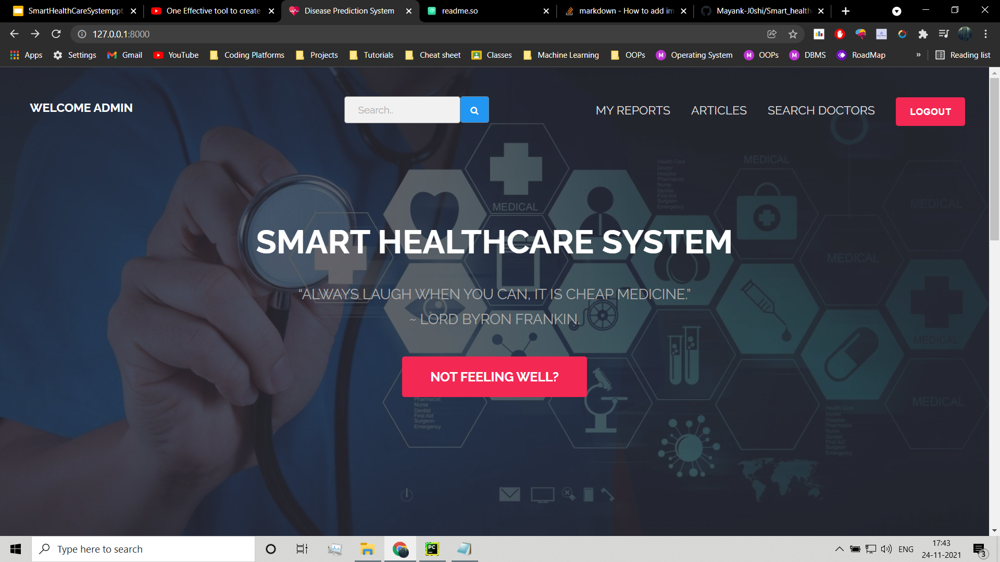
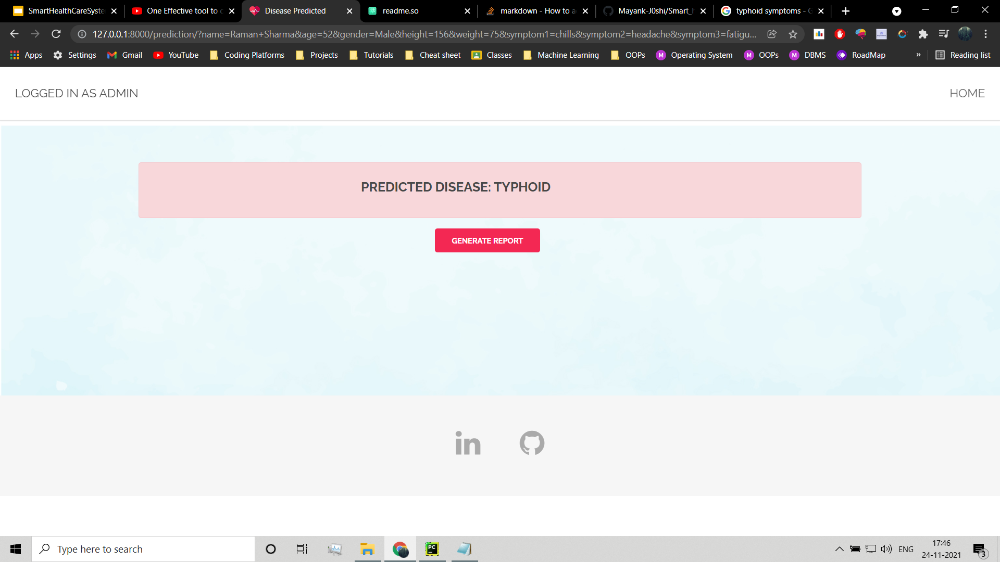

# Smart Healthcare System

The objective is to create online healthcare system that can predict the disease according to the symptoms given by the user and also seeks to solve this problem by enabling patients to get instant healthcare advice and locating to local healthcare practitioners.

## Documentation

1. Install the requirements run
```bash
  pip install -r requirements.txt
```

2. Migrate all the models used in this project
```bash
  python manage.py makemigrations
  python manage.py migrate
```
3. Finally to run this project
```bash
  python manage.py runserver
```
4. We need to add two database in our django admin so to access it create a superuser by the following command
```bash
  python manage.py createsuperuser
```
5. Access Django admin by
```bash
   running the server and adding /admin in the end
```
6. Access the Django admin and in the predict section import 
```bash
  DBM.csv --> Databases
  doc_db --> Doc_db
```

## Features

- Minimalist and elegant User Interface.
- Keeps track of your previous reports.
- Keeps you updated with different health related articles each day.
- Provides location of nearest healthcare practitioners.
- Provides information about different diseases.

## Demo





## PPT Presentation
https://docs.google.com/presentation/d/1fAF36XD0-_2vgB2S2mNc901Z7qVcXymIWFg_wt7cjaI/edit?usp=sharing
